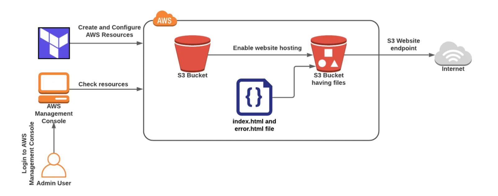

# Static Website Hosting on AWS S3 using Terraform



This Terraform script sets up a simple and cost-effective solution for hosting a static website on AWS S3. By following these instructions, you can quickly deploy and manage your static website infrastructure.

## Prerequisites

Before you begin, make sure you have the following:

- [Terraform](https://www.terraform.io/) installed on your local machine.
- AWS credentials configured on your machine with the necessary permissions.

## Getting Started

1. Clone this repository:

    ```bash
    git clone https://github.com/benncaramine/Terraform_AWS_Day_2_2
    cd Terraform_AWS_Day_2_2
    ```

2. Open the `terraform.tf` file and set the values for the variables:

    ```hcl
    aws_region = "ap-south-1"
    ```

    Adjust the `aws_region`  according to your preferences.

3. Initialize Terraform:

    ```bash
    terraform init
    ```

4. Deploy the infrastructure:

    ```bash
    terraform apply
    ```

    Type `yes` when prompted to confirm the deployment.

5. Once the deployment is complete, Terraform will output the website URL. Access your static website using this URL.

## Customizing the Website

1. **Content**: Replace the contents of the `website` directory with your static website files.

2. **Error Page**: You can customize the error page by modifying the `error.html` file in the `website` directory.

## Cleaning Up

To destroy the resources created by Terraform and clean up the infrastructure:

```bash
terraform destroy
```

Type `yes` when prompted to confirm the destruction.

## Notes

- Ensure that your S3 bucket name is globally unique to avoid conflicts.
- Make sure to configure your DNS settings to point to the CloudFront distribution once it's created.